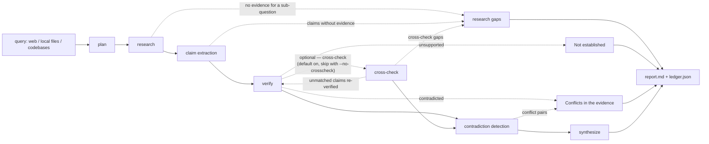

# veritas

<p align="center"></p>

**Evidence-bound research pipeline** — deterministic multi-role orchestration
over the **public web**, **local files/notes**, and **codebases**. Every factual
claim is bound to retrievable evidence and verified against re-fetched source
text; orchestration is deterministic, while LLM outputs and fetched web
evidence are not. Independent cross-checking runs when enabled (disable it with
`--no-crosscheck`); uncertainty is stated, never hidden.



Text fallback: plan → research → claims → verify → cross-check (optional) → contradiction detection → synthesize

*Caption: Evidence is bound and re-verified before synthesis; research gaps, unsupported claims, and conflicts stay visible in the output.*

## Install & configure

```bash
git init . && cp .env.example .env   # then add DEEPSEEK_API_KEY (DeepSeek API)
pip install -e .                     # or: run via  python -m veritas.cli
```

No paid search key is required — web research uses keyless engines
(DuckDuckGo, Wikipedia, arXiv, Hacker News, GitHub). Set `TAVILY_API_KEY`
(optional) to prefer a cleaner paid engine.

## Usage

```bash
veritas run "Why did the WannaCry worm spread so fast?" --surfaces web

veritas run "Summarise my notes on the agent-ecosystem plan" \
    --surfaces local --local-root ~/notes

veritas run "How is auth handled in this repo?" \
    --surfaces code --code-root ~/agent-ecosystem

veritas run "Compare X and Y" --surfaces web,local,code \
    --outdir out/mission1 --no-crosscheck --quiet
```

Every run writes two artifacts to `--outdir` (default `./out`):

* **`report.md`** — human report: answer prose, per-claim confidence table,
  verified claims with numbered sources, *Not established* (unsupported
  claims), research gaps, *Conflicts in the evidence*, and the cross-check
  summary.
* **`ledger.json`** — machine-readable evidence ledger: every claim with its
  verdict, confidence, and full evidence objects (source + quoted passage).

## Output anatomy (v0.1 — illustrative, not a benchmark)

Sample regenerated 2026-09-05 via `veritas run "Why did the WannaCry ransomware worm spread so fast in May 2017?" --surfaces web --outdir out/canonical` (deepseek-chat backend). Verbatim title and Answer text from the generated report; illustrative format only — not a quality benchmark.

```text
# Research report: Why did the WannaCry ransomware worm spread so fast in May 2017?

*Claims: 20 — high 0 · medium 20 · low 0 · unsupported 0*
*Surfaces: web*

## Answer

The rapid global spread of the WannaCry ransomware worm in May 2017 was driven by a combination of a powerful, leaked exploit, a large population of unpatched systems, and the worm's automated self-replication mechanism.

**Technical Mechanisms Enabling Automatic Propagation**

The core technical enabler was the EternalBlue exploit, which targeted a critical remote code execution vulnerability in Microsoft's SMBv1 protocol, identified as CVE-2017-0144 [MEDIUM]. This exploit worked by manipulating size parameter mismatches that led to out-of-bounds writes in the Windows kernel memory, using a technique called "Pool Grooming" to control that memory [MEDIUM]. Crucially, EternalBlue allowed unauthenticated attackers to send crafted packets to vulnerable machines over port 445, granting them full control of the system without any user interaction [MEDIUM]. Once EternalBlue compromised a machine, it delivered a kernel-level backdoor called DoublePulsar, which was then used to execute the ransomware payload [MEDIUM].

**Worm-Like Behavior and Exponential Spread**

Unlike typical ransomware of that era, which often relied on phishing or user action, WannaCry operated as a self-replicating worm. It used the EternalBlue exploit to automatically scan for and compromise other vulnerable systems over the network, leading to an exponential infection rate [MEDIUM]. This automated propagation enabled it to spread to roughly 200,000 computers in more than 150 countries in a single day on May 12, 2017 [MEDIUM]. The attack's global distribution within hours was a direct result of this worm-like behavior [MEDIUM].

**The Window of Vulnerability and Patch Timing**

The timing of events created a perfect storm. Microsoft had released a security update, MS17-010, on 14 March 2017 to patch the underlying flaw [MEDIUM]. However, the exploit code, developed by the U.S. National Security Agency, was publicly released by a group known as "The Shadow Brokers" on 14 April 2017 [MEDIUM]. WannaCry arrived just 28 days after that public release [MEDIUM]. This meant that while a patch existed, its adoption was not widespread enough to protect systems before the worm struck.

**The Global State of Unpatched Systems**

The primary reason for the worm's success was the vast number of vulnerable, unpatched Windows systems. The persistence of EternalBlue as a threat is driven by poor patching practices and reliance on legacy Windows systems [MEDIUM]. Microsoft released the security update a month before the exploit's public exposure, but widespread delays in patch adoption left hundreds of thousands of systems vulnerable [MEDIUM]. This large vulnerable population, combined with the worm's automated scanning, allowed it to spread so quickly.

**Network-Level Factors**

The provided evidence confirms that WannaCry's spread was modeled using an epidemic spread metric (R0), which is used to measure how quickly an infection spreads through a population [MEDIUM]. This modeling underscores the network-level, self-propagating nature of the attack. However, the specific effects of network congestion, SMB port filtering, and ISP-level throttling or blocking on propagation speed in different regions and sectors are not detailed in the available evidence.
```

*Annotation:* The report also contains per-claim verified statements with numbered sources, a Gaps noted during research list, a Conflicts in the evidence section (semantic contradiction detection), and a cross-check summary (independent claims produced: 3; corroborated primary claims: 0; final distribution: medium=20). The annotation is not part of the verbatim report.

Confidence semantics:

| tag | meaning |
|-----|---------|
| `high` | claim supported by its sources **and** independently corroborated by the cross-check pass from different sources |
| `medium` | supported by re-fetched source text (single run / single source) |
| `low` | only partially supported (verifier supplies the corrected statement) |
| `unsupported` | **not asserted** — evidence could neither support nor refute it; reported under *Not established* |

With `--no-crosscheck`, claims cannot reach `high` (no independent corroboration) — they cap at `medium`.

## Reliability design (the short version)

1. **No claim without evidence.** The claim extractor must cite evidence by
   index; un-cited or out-of-range citations are rejected into a gaps list —
   the model can never inject support from thin air.
2. **Verification re-reads the source.** The verifier re-fetches each cited
   source (web pages re-downloaded; file/code sources re-read at their exact
   `#L#-#` anchor) and judges the claim against that text: supported / partial
   / contradicted / unsupported, with a corrected statement when partial.
3. **Independent cross-check.** Unless `--no-crosscheck` is set, a second,
   differently-planned research pass runs; high confidence therefore requires
   this pass. Its claims are reconciled deterministically. Agreement from
   *different* sources bumps confidence to `high`; unmatched findings are put
   through the verifier (never trusted unchecked) before being appended.
4. **Semantic conflict detection.** One dedicated pass pairs claims that
   cannot both be true — antonyms defeat token matching, so this is the one
   place an LLM judges *relationships between claims*, with index validation.
5. **Honest failure.** Claims the sources can't establish are reported as
   *Not established*, and contradictions are shown rather than smoothed over.

## Development

```bash
python3 -m pytest -q        # 52 hermetic tests, no network, FakeLLM-driven
```

`veritas run "..." --fake` runs the full pipeline offline with scripted model
responses, useful for a no-key demo of the report shape. Set
`VERITAS_LLM_LOG=/path/log.txt` to audit every prompt/response the team sends.

See `docs/DESIGN.md` for the full architecture, role contracts, and the
threats each stage defends against.
