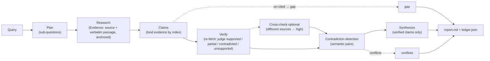

# veritas design

Goal: a research team whose *process* — not just its model — makes output
accurate and reliable enough for an internal tool. The team is implemented as
deterministic pipeline stages; the only non-determinism is the LLM behind each
stage, and every stage's output contract is enforced in code.

**Evidence lifecycle at a glance**



## Why deterministic roles instead of live agents?

Live multi-agent systems are excellent at exploration but hard to make
*accountable*: no structural guarantee connects an assertion to a retrievable
origin. Here, roles are code with narrow LLM subtasks:

- **determinism** — same query + same evidence ⇒ same structure; tests are
  hermetic (FakeLLM); a failure is reproducible.
- **enforceable contracts** — claims cite evidence by index; verdicts come
  from a fixed enum; confidence derives from a fixed mapping. The LLM proposes,
  the code disposes.
- **cost-bounded** — every stage is a bounded call; nothing loops unboundedly.

## Domain model (`schema.py`)

```
Query(text, surfaces[], sources[])
  └─ Plan(overview, SubQuestion[], crosscheck_seed_note)
       └─ Evidence(source, passage, kind)     ← the atomic unit of support
            └─ source: Source(url|path, anchor L#-#, surface)
       └─ Claim(id, statement, subquestion, evidence[], verdict, confidence,
                crosschecked, conflicts, note)
Report(answer, claims[], gaps[], conflicts[], crosscheck{}, surfaces_used)
```

A claim is **nothing more** than a statement plus the evidence objects it was
bound to. There is no free-text support field anywhere.

## Pipeline stages

### 1. Planner
LLM decomposes the query into 1–5 sub-questions plus a *cross-check seed note*
(alternative framing). Parsed leniently; falls back to a single question.
Cross-check planner re-plans independently (different decomposition).

### 2. Researcher (`research.py`, `connectors/`)
Per sub-question, each enabled surface is searched. Providers:

| surface | engines |
|---|---|
| web | DuckDuckGo (keyless fallback) · Wikipedia · arXiv · Hacker News/Algolia · GitHub repo search · Tavily when `TAVILY_API_KEY` set · direct URL fetch |
| local | file/notes search: token match over walked tree, exclusions, text sniff, line-window passages |
| code | git-tracked files (or walk fallback), structural `overview()` for the researcher |

Evidence passages are **quoted verbatim** with an anchor (`url` for web,
`path#L12-L20` for files). The strongest sources are re-fetched to full text so
later stages read the document, not a snippet. Connectors never raise into the
pipeline — they return what they got plus warnings.

### 3. Claim extractor (`claims.py`)
LLM proposes claims each citing `evidence_idx` numbers. The module then:

- rejects claims with empty/out-of-range/non-numeric citations → gaps list
  ("claim without evidence was dropped");
- attaches the *real* `Evidence` objects by index;
- dedupes statements (runner, across sub-questions, keeping the richest copy).

### 4. Verifier (`verify.py`)
Per claim: re-fetch each cited source (web re-downloaded; file/code re-read at
the anchor). LLM judge returns `supported | partial | contradicted |
unsupported` + reason (+ corrected statement for partial/contradicted). The
verdict is parsed strictly; anything else ⇒ unsupported. Confidence mapping is
deterministic:

```
supported    → medium
partial      → low (statement corrected by better_statement)
contradicted → low, shown under "Conflicts", never asserted
unsupported  → unsupported, reported under "Not established"
```

### 5. Cross-check (`crosscheck.py`)
- independent plan → research → claims (same extractor, so same binding rules);
- `reconcile()` matches primary vs cross claims by token-Jaccard ≥ 0.5.
  Agreement from **different** sources ⇒ `medium → high`. Conservative by
  design: a wrong "agreement" is worse than none, so antonyms are *not* treated
  as agreement here;
- unmatched cross claims become **candidates** that go through the verifier,
  then are appended tagged `(from the independent cross-check pass)`.

### 6. Contradiction detection
One LLM pass over final assertable claims returns index pairs `[i,j]`;
validated against the real list (cannot invent claims), deduped, sorted. This
catches semantic opposites that defeat token matching.

### 7. Synthesizer (`synthesize.py`)
Prose written from verified claims only (groups carry `[HIGH]/[MEDIUM]/[LOW]`
tags). The rest of `report.md` is assembled deterministically from the ledger —
structure can never drift from verified data. Sources are numbered once per
locator; evidence renders with a confidence tag and inline reference numbers.

## Failure semantics

| failure | behaviour |
|---|---|
| connector down | empty results + warning logged; mission continues |
| no evidence for a sub-question | recorded in `gaps` |
| claim with no valid evidence ref | dropped, recorded as a gap |
| verifier gets no source text | strict: prefers `unsupported` |
| cross-check errors | logged; mission completes without it (flag in report) |
| prose synthesis errors | report still renders from the ledger (empty Answer) |
| LLM returns unparseable JSON | `extract_json` lenient scan; raises ⇒ stage-specific handling |

## Cost & bounds (env-configurable)

sub-questions ≤ 5 (default), evidence per sub-question ≤ 8 + fetch_top 3,
claims ≤ 40 (deduped before verification), cross-check half-size, one
contradiction pass, single retry on transient HTTP. Verification is the
dominant cost and is parallelised (4 workers) over claims.

## Threat model

| risk | defence |
|---|---|
| hallucinated support | evidence binding by index, enforced post-hoc |
| snippet lies | verifier re-fetches and re-reads the full source |
| one source wrong | independent cross-check from different sources ⇒ only then `high` |
| synonym paraphrases | corroboration only on high token overlap (conservative) |
| antonym contradictions | dedicated semantic contradiction pass |
| overclaiming ("all" vs "most") | verifier returns partial + corrected statement |
| silent gaps | unsupported claims reported under *Not established* |
| audit loss | `ledger.json` persists per run in the output directory; generated outputs are gitignored (not repo-provenanced); `VERITAS_LLM_LOG` captures prompts when set |
